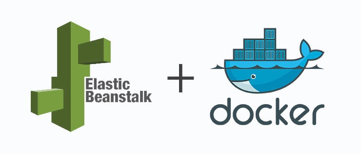

# Deploy-Docker-App-AWS-EB

Custom CLI to deploy a dockerized [Spring Boot](https://spring.io/projects/spring-boot) application to [AWS Elastic Beanstalk](https://aws.amazon.com/elasticbeanstalk/).



# Application

This folder contains the sample code for a Spring boot application. See the instructions below for how to deploy and run this application.


## Dependencies

* `PostgreSQL`: Version 9.6 or higher is required. For development environment a docker-compose is provided within this project.
* `Java 8`

## Run application

### Dev environment

1. Go to the application directory.
2. Deploy BBDD dependencies: 

    ```
    docker-compose up
    ```

3. Run the application:

    ```
    ./gradlew run
    ```

### Prod environment

1. Build the application: 

    ```
    ./gradlew build
    ```

    This command will generated the following jar: `build/libs/helloworld-0.0.1-SNAPSHOT.jar`

2. Run the application: 

    ```
    java -jar helloworld-0.0.1-SNAPSHOT.jar --spring.profiles.active=pro
    ```

In both cases, application will run in the 8000 port.

Note: In deploy time a script initializing the Database will be executed, this script could take more than 3 minutes.

## REST API

This application provides a REST API for get users info.

### Get User

* **URL:** `/users/{userId}`
* **Method:** `GET`
* **Response:**  

    ```json
    {"id":104,"name":"user104","surname":"surname104","type":3}
    ```

### Get Users by type

Gets the users of the given type. 

* **URL:** `/users?userType={userTypeId}`
* **Method:** `GET`
* **Response:**  

    ```json
    [
      {"id":23,"name":"user23","surname":"surname23","type":6},
      {"id":32,"name":"user32","surname":"surname32","type":6},
      {"id":38,"name":"user38","surname":"surname38","type":6}
    ]
    ```

Possible values of `userType` are between `1` and `10`.

#### Note:

Application and access logs will be generated in the following folder: `/var/log/helloworld` 

# Deployment

## How does it work?

The `deploy.py` CLI deploys the Spring boot example application to AWS Elastic Beanstalk performing the following tasks:

1. Create a boto3 session to store the AWS credentials and the region to use for the deployment. If there is any configuration defined through [environment variables](https://docs.aws.amazon.com/cli/latest/userguide/cli-configure-envvars.html) or stored in AWS CLI `~/.aws` folder, the AWS credentials and the region are directly retrieved from there (it is possible to specify the profile to use as optional argument). Otherwise, the CLI asks for these parameters interactively.
2. Check if the Elastic Beanstalk application is already created, and if not, create it.
3. Build the Spring boot example application.
4. Create the ZIP package (source bundle) for the new application version.
5. Upload the application version package to a source bundle S3 bucket.
6. Create the new application version for the Elastic Beanstalk application.
7. Create the environment if it does not exist or has been previously terminated, or update it if it is already created. The CLI check if there is an operation in progress in the environment and wait for it to be completed before updating or recreating it.

## Dependencies

* `Python 3.3+`
* `boto3`

## Prerequisites

* The `aws-elasticbeanstalk-ec2-role` instance profile (AWS IAM EC2 Role) created in the AWS account:

    [Managing Elastic Beanstalk instance profiles](https://docs.aws.amazon.com/elasticbeanstalk/latest/dg/iam-instanceprofile.html)

* The `aws-elasticbeanstalk-service-role` service role (AWS IAM Elastic Beanstalk Role) created in the AWS account:

    [Managing Elastic Beanstalk service roles](https://docs.aws.amazon.com/elasticbeanstalk/latest/dg/iam-servicerole.html)

* An IAM User or an AWS IAM Role attached to the EC2 instance (only for executions from EC2 instances) with the following IAM Managed Policy attached:

      AWSElasticBeanstalkFullAccess

* Pip tool for Python packages management. Installation:

      # From Linux
      $ curl -O https://bootstrap.pypa.io/get-pip.py
      $ sudo python3 get-pip.py

      # From macOS
      $ brew install python

* AWS SDK for Python. Installation:

      # From Linux
      $ sudo pip3 install boto3

      # From macOS
      $ pip3 install boto3

## Execution Method

Here you have the message that you will get if you request help to the `deploy.py` CLI:

    $ ./deploy.py --help
    usage: deploy.py [-h] -a APPLICATION_NAME -e ENVIRONMENT_NAME [-p PROFILE]

    Custom CLI to deploy an application to AWS Elastic Beanstalk

    optional arguments:
      -h, --help            show this help message and exit

    Options:
      -a APPLICATION_NAME, --application-name APPLICATION_NAME
                            Name of the Elastic Beanstalk application
      -e ENVIRONMENT_NAME, --environment-name ENVIRONMENT_NAME
                            Name of the environment for the Elastic Beanstalk
                            application
      -p PROFILE, --profile PROFILE
                            Use a specific profile from AWS CLI stored
                            configurations

## Provided Configuration Profiles

This project provides the following configuration profiles:

* `env.yaml.staging` => Configuration profile intended for staging environments deployed for development, test, QA or demo purposes (lower cost and performance)
* `env.yaml.production` => Configuration profile intended for environments with productive loads

## Execution Examples

    # Deployment of a staging environment
    $ ln -sf env.yaml.staging env.yaml
    $ ./deploy.py --application-name helloworld --environment-name test [--profile <aws_cli_profile>]

    # Deployment of a productive environment
    $ ln -sf env.yaml.production env.yaml
    $ ./deploy.py --application-name helloworld --environment-name live [--profile <aws_cli_profile>]

## Environment Customization

If you need to modify any settings provided in this project or add new ones, feel free to fork or import this repository and apply the changes you need to fulfil your use case.

Here are some common customizations that you might want to add to an environment:

* To deploy a `SingleInstance` type environment in a existing custom VPC, add the following configuration block to the `env.yaml.staging` file:

        aws:ec2:vpc:
          VPCId: <vpc_id>
          Subnets: <subnet_1a_id>,<subnet_1b_id>,...      # Subnet IDs for EC2 instance
          DBSubnets: <subnet_2a_id>,<subnet_2b_id>,...    # Subnet IDs for RDS instance

* To deploy a `LoadBalanced` type environment in a existing custom VPC, add the following settings to the existing `aws:ec2:vpc` namespace in `env.yaml.production` file:

        aws:ec2:vpc:
          ELBScheme: public                               # This setting is already defined
          VPCId: <vpc_id>
          ELBSubnets: <subnet_3a_id>,<subnet_3b_id>,...   # Subnet IDs for ELB
          Subnets: <subnet_1a_id>,<subnet_1b_id>,...      # Subnet IDs for Auto Scaling group
          DBSubnets: <subnet_2a_id>,<subnet_2b_id>,...    # Subnet IDs for RDS instance
          AssociatePublicIpAddress: true                  # Review this option in https://amzn.to/2Vhgt5B

* To configure HTTPS in a `LoadBalanced` type environment for a custom domain using an ACM issued certificate, add the following configuration block to the `env.yaml.production` file:

        aws:elb:listener:443:
          ListenerProtocol: HTTPS
          InstancePort: '80'
          InstanceProtocol: HTTP
          ListenerEnabled: true
          SSLCertificateId: <acm_certificate_arn>

    Then uncomment the `https-redirect-docker-sc` container command block in `.ebextensions/server-updates.config` file:

        https-redirect-docker-sc:
          command: cp .ebextensions/nginx/elasticbeanstalk-nginx-docker-proxy.conf /etc/nginx/sites-available/
          test: '[ "$(/opt/elasticbeanstalk/bin/get-config environment -k CONFIG_PROFILE)" == "production" ]'

* To configure a SSH key pair to securely log into the EC2 instance/s belonging to an environment, add the following setting to the existing `aws:autoscaling:launchconfiguration` namespace in any of the `env.yaml.<config_profile>` files:

        aws:autoscaling:launchconfiguration:
          . . .
          . . .
          EC2KeyName: <key_pair_name>

## Related Links

* [Single Container Docker Configuration](https://docs.aws.amazon.com/elasticbeanstalk/latest/dg/single-container-docker-configuration.html)
* [Environment Manifest (env.yaml)](https://docs.aws.amazon.com/elasticbeanstalk/latest/dg/environment-cfg-manifest.html)
* [General options for all environments](https://docs.aws.amazon.com/elasticbeanstalk/latest/dg/command-options-general.html)
* [Configuring HTTP to HTTPS redirection](https://docs.aws.amazon.com/elasticbeanstalk/latest/dg/configuring-https-httpredirect.html)
* [AWS SDK for Python (Boto3)](https://aws.amazon.com/sdk-for-python/)
